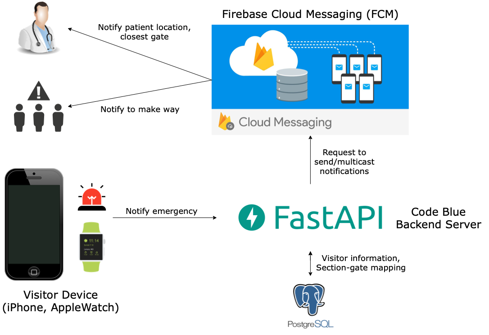

# CodeBlue

CodeBlue is a mobile application and a server that our team (4rsenal) completed over 3 days
in [TartanHacks 2022](https://www.tartanhacks.com). The name came from a hospital emergency code used to describe the 
critical status of a patient.

## Video 

https://www.youtube.com/watch?v=j6a8mXvD7Z0

## Inspiration

With recent awareness of heart attack becoming high in the sports scenes, the health of the spectators/crowd has also
become a major issue. Recently in the English Premier League (EPL) there have been several cases of sudden heart attacks
which have put lives in danger. It came to our knowledge that these kinds of sudden heart attacks in the stands were
nothing new but something that we became aware of recently. We have seen multiple matches being stopped in the middle,
to give time and space for the patient. However, the crowdedness and the enormity of the stadiums makes it difficult to
locate and alert the doctors. Thus, we built a mobile application and a server that help us locate and detect the
patient and the doctors around the stadium to give the fastest possible treatment to the person in need.

## Architecture

<p align="center">
  
</p>

## Project Structure

### [Server](https://github.com/kyminbb/code-blue/tree/main/server) - CodeBlue Backend Server

- FastAPI
- PostgreSQL
- Async SQLAlchemy
- Alembic
- Firebase Cloud Messaging (FCM)
- Docker Compose

### [Client](https://github.com/kyminbb/code-blue/tree/main/client) - CodeBlue Mobile Application

- Swift
- SwiftUI
- iOS / WatchOS

## Installation

### Prerequisites

- Requirements by [Firebase Cloud Messaging (FCM)](https://firebase.google.com/docs/cloud-messaging)
- Create `.env` file at `code-blue/server` with the following environment variables:
    ```bash
    POSTGRES_USER={db_username}
    POSTGRES_PASSWORD={db_password}
    POSTGRES_HOST={db_host}
    POSTGRES_PORT={db_port}
    POSTGRES_DB={db_name}

    FIREBASE_CREDENTIALS={path_to_google_application_credentials}
    ```

### Local Installation

```bash
# Clone repository
git clone git@github.com:kyminbb/code-blue.git
cd code-blue/server

# Install backend dependencies
pip install -r requirements.txt

# Run backend server
uvicorn main:app --reload
```

### Production

```bash
# Clone repository
git clone git@github.com:kyminbb/code-blue.git
cd code-blue/server

# Build image
docker-compose build

# Run containers
docker-compose up
```

### Migrations

CodeBlue server uses [Alembic](https://alembic.sqlalchemy.org/en/latest/index.html) to manage database migration.

```bash
# Create environment
alembic init alembic

# Create migration script
# Local
alembic revision --autogenerate -m {migration_message}
# Production
docker-compose run app alembic revision --autogenerate -m {migration_message}

# Run migration
# Local
alembic upgrade head
# Production
docker-compose run app alembic upgrade head
```
